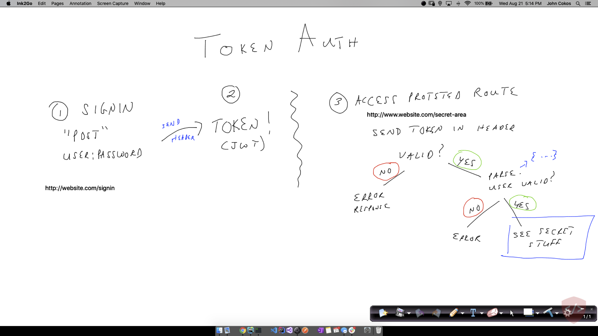

# Lecture Guide: Bearer Authorization

## Bearer Authentication

- **Why** (5 min)
  - How should we best handle every subsequent request to our server/API?
    - Pros/Cons of using Basic Authentication for every route
    - Pros/Cons of using OAuth for every route
  - We want security & speed of the process itself
  - We want flexibility in our routes
- **What** (10 min)
  - Bearer Authentication
  - Signed token given to client after a successful initial login (Basic or OAuth)
  - Same token returned by client to server on subsequent requests
  - Server can then grant or deny access based on the validity of the token and the user
- **How** (30 min)
  - After login, server gives the client a JWT Token
    - The client needs to store that ...
      - Cookies
      - Local Storage
      - .env files (if the client is another server...)
    - On every subsequent request, the client sends the token to the server in a header
      - `Authorizatio: Bearer jwt.token.here`
  - Server Side Validation
    - Validate the token
    - key+key verification (secret)
    - Other invalidation schemes (this is their lab assignment)
      - Can they think of any ideas right now?
    - Decode the token (base-64)
    - Inspect the JSON object
      - What did we put in there? (id, username, etc)
    - Find the user, make sure they're still valid
      - Why make this check?
        - Users could be inactivated, deleted, etc between requests
    - Allow the user to access the resource
- **Experimentation and Discovery Ideas**
  - Dig into the JWT tokens and standards
    - Transference of data back to the browser
    - Are these secure?
    - What can you/should you store?
      - Reference ID to lookup session data?
    - How else can we "tighten up" the system?
      - Is giving a token that works forever and ever really a good thing?
        - Isn't that what our 301 API keys do? Is this ok?
      - Solicit ideas from the class.
        - Timeouts (valid for 15 minutes)
        - Single Use Only
        - 2 Factor

## Sample Process Drawing

