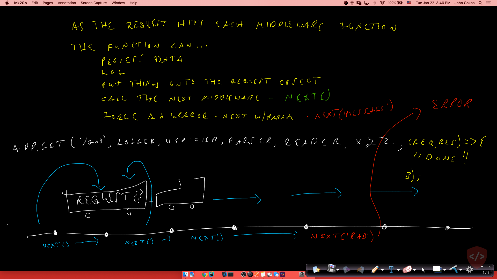

# Lecture Guide: Express

## TOPIC 1: Express Routing

- **Why** (5 min)
  - Express provides easy access to the request and response
  - Controlling the HTTP Process
  - Routing is difficult, but Express provides mappings for us
- **What** / **How** (40 min)
  - What is express?
    - Node Library making it easy to create, start, manage an HTTP server
    - Runs at an address, on a specific port
      - Explain Ports, DNS, Servers
      - What role does an express server play in WRRC?
  - **The concept of routing can start with a simple drawing, but it's best seen with an interactive demo**
    - Create a simple Express server and as you get into each of the routing concepts, make modifications to the routes and output to demonstrate the concept in real time
    - Write a few simple tests with `supergoose` for your routes to assert status codes and output
    - Demonstrate both TDD and visual/manual techniques
  - Access to parts of the URI and the request body
  - `http://api.com/people?type=active`
    - What route responds to this?
    - How do we find what 'type' was sent in?
  - `http://api.com/people/12`
    - What route(s) respond to this?
    - How can I find and use that number 12? (What is it?)
  - In any route, if there's data sent in (usually JSON), we can read access it via `request.body`
    - ... if the `express.json()` middleware was installed
  - Express tries to match routes "top down"
    - As soon as it finds a route that can handle a request, it runs that one
    - Your demo should show how this can lead to unexpected results if you have things out of order.
  - When sending a `response`, we control the type and status
    - [Status Codes](https://www.restapitutorial.com/httpstatuscodes.html)
    - Its critical that the code matches what actually happened
      - In CRUD requests, what are our possibilities (give examples to the class, and reference the chart)
        - i.e. If we create (update/delete) ... success? failure?

### TOPIC 2: Express Middleware

- **Why** (5 min)
  - We may want to apply rules to a route
    - Is the person logged in? If not, don't run our handler function
  - We may want to alter the request
    - If a person is logged in, add their ID to the request
    - Alter the content based on the user
      - Get page content from the database
      - Then, insert an ad based on the user's location
      - Then, insert their local store's address
- **What** (10 min)
  - **Conceptually -- What does it do?**
    - A series of functions that the request "goes through" before ultimately being handled
    - Draw the "train" picture  and explain how each middleware calls next to keep the train moving (and can throw stuff onto the request) or force an error.
    - Types of middleware: Application and Route
      - Application Middleware
        - Error Handling
        - Bringing in other routes
        - Defaults
        - JSON, Body and Form Parsing
      - Route Middleware
        - Dealing with specific things for a route
        - Generally, things many routes would participate in
    - How can we take advantage?
      - Logging
      - Dynamic Model Loading
      - Consistent Data Transition/Modeling/Preparation (Pre-Render)
  - **Tactically -- Middleware is any function that runs on the request**
    - Middleware functions take 3 params: `request`, `response`, and `next`
    - These functions can perform any normal task as well as operate on the request object
      - Very often, middleware functions add properties to the request object for later use in other middleware or the route itself
        - i.e. `req.timestamp` or something similar
    - They can even use the response object and send out a response
    - Or ... they can call the `next()` method, will simply run the next middleware function
      - e.g. `app.get('/test', logger, yeller, sleeper, (req,res) => {});`
      - Here, we have 3 middleware function. If logger calls `next()`, yeller will run, and so on
      - Note that our handler function is technically middleware. It's just always the last middleware to run
      - **next** ... yes, Middleware is essentially a linked list!
- **How** (30 min)
  - Do an interactive demo that hits on the following concepts
    - Custom Middleware that runs on every route using `app.use()` (e.g. a console logger)
      - App level middleware (`express.json()`)
      - Error Handling Middleware
    - Middleware that runs on some routes (defined inline with the route)
    - Middleware that writes a property onto the request object
    - Testing Middleware
      - Try and test your middleware without a server, if possible
      - Keep it as single purpose as possible so you can test in isolation
      - When it requires outside resources, consider breaking down the units for testing here and then adding an integration or end to end test in addition
      - The demo gives a good example of spying on `next()` as well as spying on the `console()`
- **Experimentation and Discovery Ideas**

## Testing Servers

- Supertest for end-to-end testing
  - Mocks out the server
  - You don't actually have to run your server to test it
  - To do this, your server code needs to be exported as a module
- Make an effort to write units that can be tested externally of the server itself
